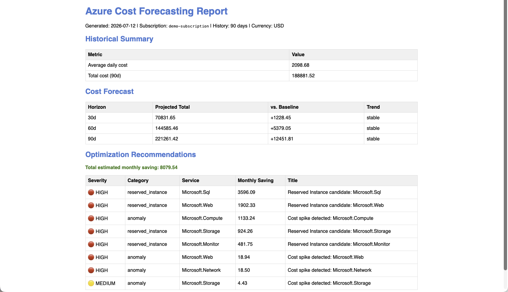

<div align="center">
  
  <h1>Azure Cost Forecasting Engine</h1>
  
</div>

[🇬🇧 English Version](README.md)

**Analyse historischer Azure-Verbrauchsdaten, Kostenprognose für die nächsten 30, 60 und 90 Tage, Erkennung von Kosten-Anomalien und priorisierte Optimierungsempfehlungen.**

Kompatibel mit dem [Microsoft FinOps Framework](https://www.finops.org/framework/). Keine externen Bibliotheken für Zahlenrechnung erforderlich, nur reines Python mit der Standardbibliothek.

[](https://github.com/9t29zhmwdh-coder/azure-cost-forecasting-engine/actions)     
[](docs/forecasting_methodology.md)

> **So läuft es:** Dies ist ein Kommandozeilen-Tool, keine Desktop-App und kein Server. `cli.py run` läuft einmal pro Aufruf und beendet sich nach dem Schreiben des Berichts; es gibt keinen Installer und keinen Hintergrundprozess. Führe `python cli.py run --demo` aus, um es mit eingebauten synthetischen Verbrauchsdaten zu sehen, keine Azure-Zugangsdaten nötig.



---

> 🌱 Neu hier? → [Schritt-für-Schritt-Anleitung für Einsteiger](GETTING_STARTED.md)

---

**In der Praxis:** du zeigst die Engine auf ein Abonnement (oder startest erst `--demo` ganz ohne Zugangsdaten), und sie gibt eine Prognose für die nächsten 30/60/90 Tage aus, markiert auffällige Ausgabetage und priorisiert konkrete Optimierungsmassnahmen (Reserved-Instance-Kandidaten, Rightsizing-Ziele) nach geschätzter monatlicher Ersparnis, als Tabelle, JSON, Markdown oder eigenständigen HTML-Bericht.

---

## Funktionen

| Funktion | Beschreibung |
|---|---|
| Datenabfrage | Tagesaktuelle Verbrauchsdaten aus der Azure Consumption API mit automatischer Seitennavigation |
| Normalisierung | Aggregation nach Dienst und Tag, lückenlose Zeitreihe |
| Kostenprognose | Ensemble aus linearer Regression und Holt-Glättung (30/60/90 Tage) |
| Anomalieerkennung | Tage, die den Mittelwert um mehr als 2,5 Standardabweichungen überschreiten |
| Trendanalyse | Klassifikation in stabil, steigend oder sinkend |
| Reserved Instances | Dienste mit stabilem Verbrauch (CV unter 15%) als RI-Kandidaten |
| Rightsizing | Dienste mit täglich steigenden Kosten über 1,5% des Mittels |
| Prognosebandbreiten | 80%-Konfidenzintervalle für alle Prognosepunkte |
| Demo-Modus | Vollständige Analyse mit synthetischen Daten ohne Azure-Zugangsdaten |
| Ausgabeformate | Tabelle, JSON, Markdown, HTML |

---

## Benötigte Azure RBAC Rolle

Registriere eine Anwendung in Entra ID und weise ihr folgende Rolle auf Abonnement-Ebene zu:

| Rolle | Zweck |
|---|---|
| `Cost Management Reader` | Lesezugriff auf Verbrauchsdetails und Abrechnungsdaten |

Keine Schreibberechtigungen erforderlich oder genutzt. Alle API-Aufrufe sind GET-Requests an die Azure Consumption API.

---

## App-Registrierung einrichten

1. Öffne das [Azure Portal](https://portal.azure.com) und navigiere zu **Entra ID > App-Registrierungen > Neue Registrierung**
2. Benenne die Anwendung (z. B. `acfe-reader`) und registriere sie
3. Navigiere zu **Abonnements > dein Abonnement > Zugriffssteuerung (IAM) > Rollenzuweisung hinzufügen**
4. Wähle **Cost Management Reader** und weise sie der Anwendung zu
5. Gehe zu **Entra ID > App-Registrierungen > deine App > Zertifikate & Geheimnisse > Neuer Client-Geheimschlüssel**
6. Kopiere den Geheimschlüssel sofort. Er wird nicht erneut angezeigt.
7. Notiere **Tenant-ID**, **Client-ID**, **Client-Geheimschlüssel** und **Abonnement-ID**

---

## Voraussetzungen

- Python 3.11+
- Optional (für Live-Azure-Daten): Azure-Abonnement mit der [Cost Management Reader](#benötigte-azure-rbac-rolle)-Rolle für eine App-Registrierung

---

## Schnellstart

```bash
git clone https://github.com/9t29zhmwdh-coder/azure-cost-forecasting-engine
cd azure-cost-forecasting-engine
pip install -e .

# Demo-Modus (keine Zugangsdaten erforderlich)
python cli.py run --demo

# Mit Azure-Zugangsdaten
cp .env.example .env
# .env mit Zugangsdaten befüllen
python cli.py run --history 90 --format table

# Markdown-Bericht exportieren
python cli.py run --demo --format md --output report.md

# JSON für Weiterverarbeitung exportieren
python cli.py run --demo --format json --output report.json
```

---

## Prognosemethodik

| Komponente | Methode | Beschreibung |
|---|---|---|
| Lineare Regression | Kleinste Quadrate | Trendlinie durch alle historischen Datenpunkte |
| Exponentielle Glättung | Holt (2 Parameter) | Gewichtet aktuelle Daten höher, reagiert auf Trendänderungen |
| Ensemble | Mittelwert beider Methoden | Reduziert Overfitting aus beiden Einzelmodellen |
| Konfidenzintervall | RMSE-basiert, 80% | Weitet sich mit zunehmendem Prognosehorizont: `1.28 * RMSE * sqrt(1 + i/n)` |
| Baseline | Gleitender 30-Tage-Mittelwert | Für Trendklassifikation und Abweichung zur Baseline |

Keine externen Bibliotheken für Zahlenrechnung nötig. Alle Berechnungen mit der Python-Standardbibliothek.

---

## Optimierungsempfehlungen

| Kategorie | Erkennungslogik | Typische Ersparnis |
|---|---|---|
| `reserved_instance` | Variationskoeffizient unter 15% über mindestens 14 Tage | 30-40% |
| `anomaly` | Tageskosten über Mittelwert + 2,5 Standardabweichungen | Variabel |
| `rightsizing` | Tägliche Kostenwachstumsrate über 1,5% des Mittelwerts pro Tag | 25-35% |

Empfehlungen sind absteigend nach geschätzter monatlicher Ersparnis sortiert.

---

## GitHub Action Integration

Kopiere `.github/workflows/ci.yml` als Vorlage und ergänze einen geplanten Lauf, um monatliche Kostenprüfungen zu automatisieren. Die `--format json`-Ausgabe kann in einem nachgelagerten Schritt an ein Ticketsystem oder einen Slack-Webhook gesendet werden.

---

## Keine Credential-Speicherung

Zugangsdaten werden ausschliesslich aus Umgebungsvariablen gelesen. Die `.env`-Datei ist gitignoriert. Keine Zugangsdaten werden gespeichert, geloggt oder in Berichten ausgegeben.

---

## Deinstallation / Aufräumen

- `pip uninstall azure-cost-forecasting-engine`
- Lokale `.env`-Datei löschen; sie enthält Tenant-ID, Client-ID und Client-Geheimschlüssel deiner Entra-ID-App-Registrierung
- Exportierte Berichte (`report.md`, `report.json`, `report.html` usw.) entfernen
- In Entra ID die App-Registrierung (z. B. `acfe-reader`) und ihre **Cost Management Reader**-Rollenzuweisung löschen, falls nicht mehr benötigt

---

**Autor:** [Rafael Yilmaz](https://github.com/9t29zhmwdh-coder) · **Status:** Active ·  · **Lizenz:** MIT
