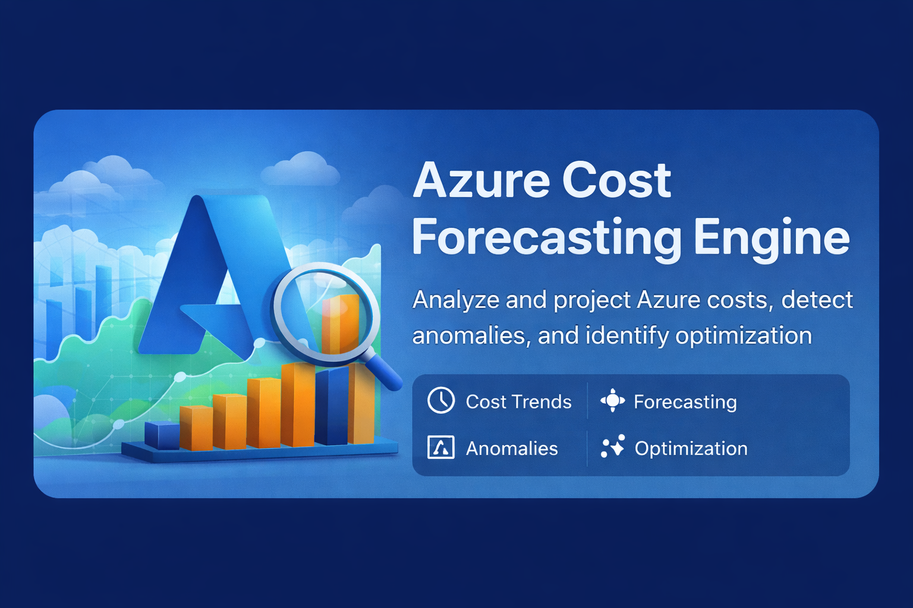

<div align="center">
  
  <h1>Azure Cost Forecasting Engine</h1>
  
</div>

> 🇩🇪 [Deutsche Version](README.de.md)

**Analyze historical Azure consumption data, forecast the next 30, 60 and 90 days of cloud spend, detect cost anomalies, and generate prioritized optimization recommendations.**

Compatible with the [Microsoft FinOps Framework](https://www.finops.org/framework/). No external numerical libraries required — pure Python with standard-library math.

[](https://github.com/9t29zhmwdh-coder/azure-cost-forecasting-engine/actions)     
[](docs/forecasting_methodology.md)

---

## Features

| Capability | Description |
|---|---|
| Usage data ingestion | Fetches daily cost data from Azure Consumption API with automatic pagination |
| Usage normalization | Aggregates raw records into daily totals per service, fills missing days |
| Cost forecasting | Ensemble of linear regression and Holt exponential smoothing (30/60/90 days) |
| Anomaly detection | Flags days exceeding mean + 2.5 standard deviations |
| Trend analysis | Classifies each service as stable, increasing or decreasing |
| RI/Savings Plan detection | Identifies services with stable usage (CV below 15%) as Reserved Instance candidates |
| Rightsizing detection | Flags services with daily cost growth above 1.5% of mean |
| Prediction intervals | 80% confidence bands for all forecast points |
| Demo mode | Full pipeline runs on synthetic data without any Azure credentials |
| Output formats | Table, JSON, Markdown, HTML |

---

## Required Azure RBAC Role

Register an application in Entra ID and assign the following role at subscription scope:

| Role | Purpose |
|---|---|
| `Cost Management Reader` | Read-only access to usage details and billing data |

No write permissions are required or used. All API calls are GET requests to the Azure Consumption API.

---

## App Registration Setup

1. Open the [Azure Portal](https://portal.azure.com) and navigate to **Entra ID > App registrations > New registration**
2. Name the application (e.g. `acfe-reader`) and register
3. Navigate to **Subscriptions > your subscription > Access control (IAM) > Add role assignment**
4. Select **Cost Management Reader** and assign it to the application
5. Go to **Entra ID > App registrations > your app > Certificates and secrets > New client secret**
6. Copy the secret value immediately. It will not be shown again.
7. Note your **Tenant ID**, **Client ID**, **Client Secret** and **Subscription ID**

---

## Quick Start

```bash
git clone https://github.com/9t29zhmwdh-coder/azure-cost-forecasting-engine
cd azure-cost-forecasting-engine
pip install -e .

# Run demo (no credentials required)
python cli.py run --demo

# Run with Azure credentials
cp .env.example .env
# Fill in your credentials in .env
python cli.py run --history 90 --format table

# Export Markdown report
python cli.py run --demo --format md --output report.md

# Export JSON for downstream processing
python cli.py run --demo --format json --output report.json
```

---

## Forecasting Methodology

| Component | Method | Description |
|---|---|---|
| Linear regression | Ordinary least squares | Fits a trend line through all historical data points |
| Exponential smoothing | Holt two-parameter | Weights recent data more heavily; adapts to trend changes |
| Ensemble | Average of both | Reduces overfit from either model alone |
| Confidence intervals | RMSE-based, 80% level | Widens with forecast distance: `1.28 * RMSE * sqrt(1 + i/n)` |
| Baseline | Rolling 30-day mean | Used for trend direction classification and vs-baseline delta |

No external numerical libraries are required. All forecasting math is implemented using the Python standard library.

---

## Optimization Recommendations

| Category | Detection Logic | Typical Saving |
|---|---|---|
| `reserved_instance` | Coefficient of variation below 15% over 14+ days | 30-40% |
| `anomaly` | Daily cost exceeds mean + 2.5 standard deviations | Variable |
| `rightsizing` | Daily cost growth rate above 1.5% of mean per day | 25-35% |

Recommendations are sorted by estimated monthly saving descending.

---

## GitHub Action Integration

Copy `.github/workflows/ci.yml` as a template and add a scheduled run to automate monthly cost reviews. The `--format json` output can be posted to a ticketing system or Slack webhook in a downstream step.

---

## No Credential Storage

Credentials are read exclusively from environment variables. The `.env` file is gitignored. No credentials are written to disk, logged, or included in any report output.

---

**Author:** [Rafael Yilmaz](https://github.com/9t29zhmwdh-coder) · **Status:** Active · v0.1.0 · **License:** MIT
